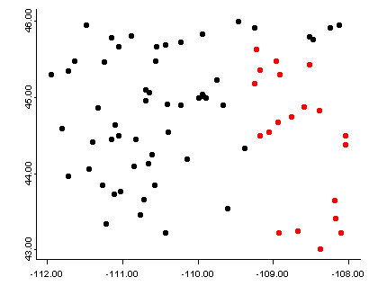
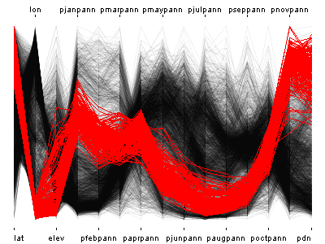
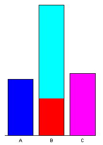
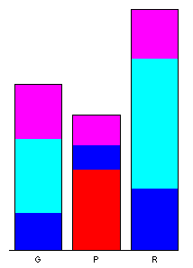
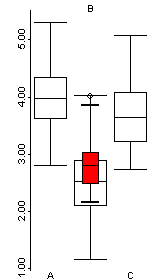

```{r set-options, echo=FALSE}
options(width = 105)
knitr::opts_chunk$set(dev='png', dpi=300, cache=FALSE)
pdf.options(useDingbats = TRUE)
klippy::klippy(position = c('top', 'right'))
```
```{r load, echo=FALSE, cache=FALSE}
load(".Rdata")
```
<p><span style="color: #FF0040;">NOTE:  Not yet revised for Spring 2020</span></p>
# Introduction #

There has been a rapid increase in the availability of data sets that may contain thousands of observations (high-resolution, i.e. high-density or high-frequency data sets) and tens or hundreds of variables or attributes (high-dimension).  Such data sets arise from:

- satellite remote sensing and other remote-sensing methods (e.g. hyperspectral methods)
- comprehensive censuses and other polling activities
- synthesis databases of existing data sets
- "reanalysis" sets of climatological variables that may consist of multiple observations per day over spans of multiple decades
- climate-model simulations of past, present and future climates
- grid-point and other forms of data exported from GIS-managed data sets.

Although computing resources now permit the rapid production of such data sets, there is still a need for visualizing and understanding the results, and in many contexts, the analysis of the data sets is lagging the production of the data.  Several approaches are evolving::

- methods for visualizing many hundreds or thousands (or more) data points using "conventional" approaches, with about a million points now (2010’s) considered to represent a "large" data set.
- methods for examining "linked" displays (usually interactively) that allow individual observations to be tracked across multiple views of a data
- special-purpose analysis methods for dealing with high-resolution (density or frequency) data sets
- traditional and novel methods for dealing with high-dimensional data sets (i.e. those with many variables, or more variables than observations)

In `R`, some of these approaches are implemented in the `R` `iplots`, `mvtsplots` and `tabplots` packages, and by appropriate modification of commonplace displays like scatterplots and parallel coordinate plots included in packages available on [`CRAN`](http://cran.us.r-project.org/), plus others available in the [`Bioconductor`](http://www.bioconductor.org/) packages as extensions of traditional mulitivariate approaches motivated by large data sets produced in the various biomedical fields.

# Enhanced standard displays #

The techniques for the display and interactive analysis of high-resolution and high-dimension data sets are rapidly developing.  The approaches illustrated here make use of the `iplots` and `tabplot` packages, plus some enhanced variations of basic plots.

## Visualizing high-resolution data sets using enhanced versions of standard displays ##

The display of high resolution data (in addition to the standard approach of simply mapping it) can be illustrated using a set of climate station data for the western United States, consisting of 3728 observations of 15 variables.  Although these data are not of extremely high resolution (or high dimension), they illustrate the general ideas.

Begin by loading the appropriate packages and  reading the data, along with a shape file that is used to quickly map the data. 

Data: [[wus_pratio.csv]](https://pjbartlein.github.io/GeogDataAnalysis/data/csv/wus_pratio.csv)     Shapefile components:  [[wus.shp]](https://pjbartlein.github.io/GeogDataAnalysis/data/shp/wus.shp) [[wus.dbf]](https://pjbartlein.github.io/GeogDataAnalysis/data/shp/wus.dbf) [[wus.shx]](https://pjbartlein.github.io/GeogDataAnalysis/data/shp/wus.shx)

```{r hd02, message=FALSE}
library(maptools) # loads sp library too
library(rgeos)
library(RColorBrewer) # creates nice color schemes
library(classInt) # finds class intervals for continuous variables
```

Here's a simple map of the station locations.  The following code produces a standard map with the stations represented by dots.  One technique to avoid overplotting is simply reducing the character size using the `cex` argument.

```{r hd03, fig.height=6, fig.width=6}
# map of precipitation stations
plot(wus.shp, lwd=3, col="gray")
points(wus_pratio$lon, wus_pratio$lat, pch=16, cex=0.8)
```

In what follows, we'll want to examine the large-scale patterns of the seasonality (summer-wet vs. winter-wet) of precipitation.  The data consist of monthly precipitation ratios, or the average precipitation for a particular month and station divided by the average annual total precipitation.  This has the effect of removing the very large imprint of elevation on precipitation totals.  The ratio of July to January precipitation provides a single overall description of precipitation seasonality.

```{r hd04, fig.height=6, fig.width=6}
# a second map with some colors
wus_pratio$pjulpjan <- wus_pratio$pjulpann/wus_pratio$pjanpann  # pann values cancel out
nclr <- 10
plotclr <- brewer.pal(nclr,"PRGn") 
class <- classIntervals(wus_pratio$pjulpjan, nclr, style="fixed",
  fixedBreaks=c(9999.0, 10.0, 5.0, 2.0, 1.25, 1.0, .800, .500, .200, 
    .100, 0.0))
colcode <- findColours(class, plotclr)
plot(wus.shp)
points(wus_pratio$lon, wus_pratio$lat, pch=16, col=colcode, main="Jan/Jul Precipitation")
legend(-125,33.5, legend=names(attr(colcode, "table")),
  fill=attr(colcode, "palette"), cex=0.6, bty="n")
```

## Transparency ##

A simple scatter plot (below, left) showing the relationship between January and July precipitation ratios illustrates how the crowding of points makes interpretation difficult.  The crowding can be overcome by plotting transparent symbols specified using the "alpha channel" of the color for individual points (below, right).


```{r hd05, fig.width=10}
# plot January vs. July precipitation ratios
opar <- par(mfcol=c(1,2))

# opaque symbols
plot(wus_pratio$pjanpann, wus_pratio$pjulpann, pch=16, cex=1.25, col=rgb(1,0,0))

# transparent symbols
plot(wus_pratio$pjanpann, wus_pratio$pjulpann, pch=16, cex=1.25, col=rgb(1,0,0, .2))
par <- opar
```

When there are a lot of points, sometimes the graphics capability of the GUIs are taxed, and it is more efficient to make a .pdf image directly.

```{r hd0, echo=TRUE, eval=FALSE, message=FALSE}
# transparent symbols using the pdf() device 
pdf(file="highres_enhanced_plot01.pdf")
plot(wus_pratio$pjanpann, wus_pratio$pjulpann, pch=16, cex=1.25, col=rgb(1,0,0, .2))
dev.off()
```
```{r hd07, include=FALSE, fig.width=10, echo=FALSE, eval=FALSE}
# transparent symbols using the pdf() device 
pdf(file="highres_enhanced_plot01.pdf")
plot(wus_pratio$pjanpann, wus_pratio$pjulpann, pch=16, cex=1.25, col=rgb(1,0,0, .2))
dev.off()
```

It's easy to see how the transparency of the symbols provides a visual measure of the density of points in the various regions in the space represented by the scatter plot.  A set of stripcharts illustrates the same principle.


```{r hd08, fig.width=10}
# stripcharts -- opaque symbols
opar <- par(mfcol=c(1,2))
stripchart(wus_pratio$pjanpann, xlab="PJan/Pann", method="overplot", pch=15, col=rgb(0,0,0))
stripchart(wus_pratio$pjanpann, xlab="PJan/Pann", method="stack", pch=15, col=rgb(0,0,0))
opar <- par
```

```{r hd09, fig.width=10}
# stripcharts -- alpha-channel transparency
opar <- par(mfcol=c(1,2))
stripchart(wus_pratio$pjanpann, xlab="PJan/Pann", method="overplot", pch=15, col=rgb(0,0,0,0.1))
stripchart(wus_pratio$pjanpann, xlab="PJan/Pann", method="stack", pch=15, col=rgb(0,0,0,0.1))
par <- opar
```

Over the region as a whole, the interesting question is the roles location and elevation may play in the seasonality of precipitation.  The following plots show that the dependence of precipitation seasonality on elevation is rather complicated.

```{r hd10, fig.width=10, fig.height=4.5}
# seasonal precipitation vs. elevation
opar <- par(mfcol=c(1,3))
plot(wus_pratio$elev, wus_pratio$pjanpann, pch=16, col=rgb(0,0,1, 0.1))
plot(wus_pratio$elev, wus_pratio$pjulpann, pch=16, col=rgb(0,0,1, 0.1))
plot(wus_pratio$elev, wus_pratio$pjulpjan, pch=16, col=rgb(0,0,1, 0.1))
par <- opar
```
[[Back to top]](lec19.html)

# The iplots package:  transparency and linked plots #

The `iplots` package provides another way of producing "alpha-channel" plots (plus more, as will be illustrated below).

## Installation ## 

The `iplots` package was designed to run in a "third-party" GUI called `JGR` which handles the execution of the Java-language plotting routines.  The installation of `JGR` on Windows is pretty straightforward, but a little tricky on the Mac.  

### Windows ###

On Windows, download and install the `iplots` package as usual.  (Also install the `rJava` package; other necessary packages should be automatically installed).  Then load the `rJava` and `iplots` packages as usual.

```{r hd11, message=FALSE, eval=FALSE}
library(rJava)
library(iplots)
```

### Mac OS X ###

On the Mac, the installation is a little more involved, `iplots` is run through an "IDE/script editor"" called `JGR`, which combines a script editor and console window, and resembles the usual Mac OS X R GUI.  `JGR` was built using an older version of Java (Java 6), and the appropriate "runtime environment" (currently Java for OS X 2015-001) has be downloaded from Apple and installed. 

Go to [https://support.apple.com/kb/DL1572?locale=en_US](https://support.apple.com/kb/DL1572?locale=en_US), and click on the "Download" button, and follow instructions.

(Note:  Apple recommends keeping Java up to date.  To download the current Java run-time environment (JRE) from Oracle.  

- Go to [[http://www.oracle.com/technetwork/java/javase/downloads/index.html]](http://www.oracle.com/technetwork/java/javase/downloads/index.html).  Click on the JRE Download button, follow the instructions, and eventually download and install `jre-8u121-macosx-x64.dmg` (or the most current version).  Then  
- Open a terminal window and type or copy and paste the following (including the quotes `"`):  
`export JAVA_HOME="/Library/Internet Plug-Ins/JavaAppletPlugin.plugin/Contents/Home"`
- Check the installation by typing `java -version` and you should see `java version "1.8.0_121-b13"`)

Then download `JGR` and the appropriate libraries:

- Go to [[http://rforge.net/JGR/files/]](http://rforge.net/JGR/files/) and download `JGR-1.8.dmg` (at the time of this writing), and then open the disk image and install it by copying it to your Applications folder. (Note that there is a `JGR` application (`JGR.app`) and the `JGR` `R` package; they’re not the same thing, and both need to be installed.)
- install `JGR-1.8.dmg` (you may have to deal with Mac security restrictions)
- Install the necessary packages the usual way (i.e. `install.packages(c("rJava", "JavaGD", "iplots"))`)

Then, to run `JGR`:

- load the `JGR` package by typing `library(JGR)`; some warnings will be produced.
- Then start `JGR` by typing `JGR()` in the `R` or `RStudio` console window. (It's ok to quit `R` or `RStudio` at this point.)
- switch to the `JGR` app.
- use the `JGR` `Workspace` menu to load a workspace, or paste the following into the bottom pane of the `JGR` app:

```{r loadWorkspace, eval=FALSE, echo=TRUE}
con <- url("https://pjbartlein.github.io/GeogDataAnalysis/data/Rdata/geog495.RData")
load(file=con)
close(con)
```

(`JRG` maintains its own workspace (and `.RData` file), distinct from the one maintained by RStudio.)

## Scatter-plot maps ##

Here's the `iplots` version of the scatter-plot map.  Note the size of the symbols can be controlled by the up and down arrow keys, and the transparency by the right and left arrow keys.

```{r hd12, echo=TRUE, eval=FALSE}
attach(wus_pratio)
# simple scatter plot iplots version with transparency
# use arrow keys to control transparency and symbol size
iplot(elev,pjanpann, xlab="elev", ylab="pjanpann") 
detach(wus_pratio)
```


[[Back to top]](lec19.html)

## Linked interactive plots and "brushing" ##

Linked plots are those in which multiple plots are generated and viewed, and particular observations are flagged or "brushed" to call attention to them in each of the individual plots.  The iplots package provides an easy way to create a small number of linked plots.  The data set used here (precipitation ratios in the region around Yellowstone National Park) is a subset of the larger data set, and facilitates a more rapid demonstration.  The function `ipcp()` creates a parallel-coordinates plot, while the function `iplot()` in this instance creates a crude map. After the plots are created, the mouse can be used to draw a rectangular selection region that "lights up" points in both plots.  

Note:  If you get a "Data length mismatch" dialog box warning when executing the code below, reply "Yes".

### Linked plots with continuous variables ##

```{r hd15}
# linked interactive plots -- brushing
# example with Yellowstone region pratios iplots version
attach(yellpratio)
names(yellpratio)
```

```{r hd16, echo=TRUE, eval=FALSE}
# parallel coordinate plot plus scatter plot map
ipcp(yellpratio) # use arrow keys to control transparency
iplot(Lon, Lat) # use arrow keys to control symbol size
```

Here, stations with low winter precipitation ratios were selected on the parallel coordinates plot, and the corresponding locations are shown on the scatter-plot map.

 

```{r hd17}
detach(yellpratio)
```

Here's a second example using the higher-density western U.S. precipitation ratios:

```{r hd18}
# example with the higher-density western U.S. pratios
attach(wus_pratio) 
```

```{r hd19, echo=TRUE, eval=FALSE}
# parallel coordiate plot plus scatter plot map
ipcp(wus_pratio) # use arrow keys to control transparency
iplot(lon, lat) # use arrow keys to control symbol size
```

In these linked plots, the stations in western Oregon and Washington were selected on the map, and the parallel coordinates plot shows their precipitation "regimes".

 

```{r hd20}
detach(wus_pratio)
```

### Linked plots with categorical variables ###

Data sets that contain a mixture of categorical or factor variables and ordinal or ratio-scale "continuous" variables can also be visualized, as illustrated by the Summit Cr. data set.  Here the "continuous" variables (`CumLen` and `WidthWS`) appear in boxplots and scatter plots (right), with `WidthWS` on the y-axis, and `Reach` or `CumLen` on the x-axis, while the categorical variables, `Reach` and `HU` are summarized by traditional bar plots and mosaic plots.


```{r hd22, echo=TRUE, eval=FALSE}
# linked plots -- Summit Cr. data set, including categorical variables
attach(sumcr)
imosaic(data.frame(Reach,HU))
ibar(HU)
ibar(Reach)

# add a scatter plot
iplot(CumLen, WidthWS)
iplot.opt(col=unclass(Reach)+3)

# add a boxplot
ibox(WidthWS, Reach)
```

On the plots below, pools (`P`) in the exclosure reach (`B`) were highlighted in the mosaic plot, and appear in red on the other plots.

    
  

```{r hd23, eval=FALSE}
detach(sumcr)
```

[[Back to top]](lec19.html)

# High-density plots with the `tabplot` package #

The "tableplot" is an interesting visualization method that can be useful for discovering large-scale patterns in the covariations among a small (< 15) set or subset of variables, which can be either continuous or categorical.  The basic idea is to organize the rows of a data set along an axis of increasing or decreasing values of a continuous variable or the different "levels" of a categorical variable.  A reduction in the density of the data is achieved by binning multiple rows of the data and plotting bin averages (or frequencies) of the variables.  As in all compositing techniques, if there a consistent response in the other variables to the variable selected to organize the rows, then this will emerge, otherwise inconsistent responses will wash each other out, and no apparent pattern will be evident in the plots of the other variables.

This example makes use of a data set of 4360 modern pollen samples for North America, from Whitmore et al. (2005, *Quaternary Science Reviews*).  The variables include the location and elevation of each sample, the relative abundances of the 12 most-abundant pollen types (transformed by taking square roots), and two categorical variables, Federova et al. (1994) vegetation types and USGS land-cover types from satellite remote-sensing data (see Whitmore et al. 2005 for details).  This data set provides an interesting example, inasmuch as the resulting tableplots are reminiscent of "downcore"-plotted pollen diagrams.

## Read and map the North American modern pollen data set ##

```{r read napollen}
# read the North American modern pollen data
csv_path <- "/Users/bartlein/Dropbox/DataVis/working/data/csv_files/"
csv_name <- "NAmodpol.csv"
csv_file <- paste(csv_path, csv_name, sep="")
napol <- read.csv(csv_file) # takes a while
str(napol)
```

Map the pollen site locations:

```{r hd31, fig.width=6, fig.height=5}
library(maps)
plot(napol$Lat ~ napol$Lon, type="n")
map("world", add=TRUE, lwd=2, col="gray")
points(napol$Lat ~ napol$Lon, pch=16, cex=0.6, col="darkgreen")
```

<!-- ## Tableplots ## -->
<!-- Load the `tabplot` package.  Note that `tabplot` loads some other packages (`ffbase`, `ff`, `bit`, etc.) that allow for efficient processing of large data sets and replace some of the functions in the `base` package.  It might be good to restart R after using the `tabplot` package. -->

<!-- ```{r hd32, message=FALSE} -->
<!-- library(tabplot) -->
<!-- ``` -->

<!-- Here's a simple tableplot, with the observations arranged by latitude (`sortCol="Lat"`) and linear scales specified for all continuous variables (`scales="lin"`, the `tabplot()` function attempts to find a suitable scale for each variable, but here the pollen variables were all transformed prior to the analysis, and so we want to suppress further transformation here). -->

<!-- (Note that it just happens that the resulting plot looks like a standard pollen diagram--this isn't designed in any way.) -->

<!-- ```{r hd33, echo=TRUE, fig.width=10, eval=FALSE} -->
<!-- tableplot(napol, sortCol="Lat", scales="lin") -->
<!-- ``` -->
<!-- ```{r hd34, fig.width=9, message=FALSE, echo=FALSE} -->
<!-- suppressWarnings(tableplot(napol, sortCol="Lat", scales="lin")) -->
<!-- ``` -->

<!-- It's possible to see broad trends in all of the pollen types, as well as in the frequency of different vegetation types as a function of latitude. -->

<!-- Each bin the above plot represents a bin that, in this case, holds 46 observations, and what is plotted as bars in each column  is the bin-average or frequency for those observations. Here's a second plot like the first, using more bins: -->

<!-- ```{r hd35, echo=TRUE, eval=FALSE} -->
<!-- tableplot(napol, sortCol="Lat", scales="lin", nBins=200) -->
<!-- ``` -->
<!-- ```{r hd36, fig.width=9, message=FALSE, echo=FALSE} -->
<!-- suppressWarnings(tableplot(napol, sortCol="Lat", scales="lin", nBins=200)) -->
<!-- ``` -->

<!-- The same broad-scale patterns are evident in this plot, suggesting that the approach is robust with respect to the number of bins.  The next plot using the abundance of *Picea* (spruce to organize the data): -->

<!-- ```{r hd37, echo=TRUE, eval=FALSE} -->
<!-- tableplot(napol, sortCol="Picea", scales="lin", nBins=100) -->
<!-- ``` -->
<!-- ```{r hd38, fig.width=9, message=FALSE, echo=FALSE} -->
<!-- suppressWarnings(tableplot(napol, sortCol="Picea", scales="lin", nBins=100)) -->
<!-- ``` -->

<!-- The plot shows that *Aremisia* (sagebrush) pollen has a similar profile to *Picea* and both tend to be high at high elevation and low (western) longitudes.  The next plot using one of the categorical variables to organize the data. -->

<!-- ```{r hd39, echo=TRUE, eval=FALSE} -->
<!-- tableplot(napol, sortCol="Fed", scales="lin", nBins=100) -->
<!-- ``` -->
<!-- ```{r hd40, fig.width=9, message=FALSE, echo=FALSE} -->
<!-- suppressWarnings(tableplot(napol, sortCol="Fed", scales="lin", nBins=100)) -->
<!-- ``` -->

<!-- The blockiness of the different profiles shows that the individual vegetation types have distinctive mixtures of the different pollen types. -->

<!-- [[Back to top]](lec19.html) -->

<!-- # Plotting multivariate/multiple time series # -->

<!-- Although the tableplots above happened to look like conventional pollen diagrams, which were a comparatively early attempt to visualize multivariate data, the data displayed by the `tableplot()` function does not necessarily need to be a series.  The next example illustrates a display method in which the data *do* form a series, in this case pollen data again, only this time for a single site, which form a multivariate time series. -->

<!-- ## Read the Carp L. pollen data ## -->

<!-- The data here come from a long pollen record from Carp L., in Washington State.  (Whitlock, C.L., et al. (2000) *Palaeogeography Palaeoclimatology Palaeoecology* 155(1-2):7-29 DOI: 10.1016/S0031-0182(99)00092-9).  Pollen data are "long-tailed" and so the data were transformed earlier by taking the square root of the pollen percentages. -->

```{r read carp}
# read Carp L. pollen data (transformed to square-roots)
csvpath <- "/Users/bartlein/Dropbox/DataVis/working/data/csv_files/"
csvname <- "carp96t.csv" # square-root transformed data
carp <- read.csv(paste(csvpath, csvname, sep=""))
summary(carp)
```

## The plots ##

The idea behind the `mvtsplots()` package (and function) is to use color to reveal underlying patterns in the data.  The first plot shows the "raw" data, simply coded for each pollen taxon independently from low (magenta) to high (green).  The plots on the margins are of boxplots for the individual series (right), and a time series of the median values across all series (bottom), which attempt to summarize the overall level of the series.

```{r mvtsplots01}
library(mvtsplot)
mvtsplot(carp[, 4:25], xtime=carp$Age, levels=9, margin=TRUE)
```

Plotted this way, one begins to get an idea of some organization to the data along the time axis.  The plot is a little noisy, and can be simplified by smoothing the individual series.

```{r mtvsplot02}
mvtsplot(carp[, 4:25], xtime=carp$Age, smooth.df=25, levels=9, margin=TRUE)

```

Further simplification can be gotten by "normalizing" the data, transforming and assigning colors based on the range of values in each series individually.

```{r mtvsplot03}
mvtsplot(carp[, 4:25], xtime=carp$Age, smooth.df=2, norm="internal", levels=9, margin=TRUE)
```

The color field now shows that the data are well organized in time, which can be verified by adding a plot of the variable `IS` i.e. the MIS (Marine Isotopic Stage) to the plot (on the last row).

```{r mvtsplot04}
mvtsplot(carp[, 3:25], xtime=carp$Age, smooth.df=2, norm="internal", levels=9, margin=TRUE)
```

[[Back to top]](lec19.html)

# Interactive visualization of a raster brick #

In addition to the tools for visualizing rasters provided by the `rasterVis` package (including Hovmöller and horizon plots--[[`raster` package examples]](week04-raster.html)), the `maptools` package provides a way of interactively visualizing raster bricks, by displaying three individual Hovmöller plots, arranged to look like a brick.

Load the required packages

```{r cube, message=FALSE}
# load packages
library(maptools)
library(raster)
library(rasterVis)
library(RColorBrewer)
library(mapview)
```

Read a world shapefile to overlay on simple `levelplot()` maps for orientation.

```{r read world shape file, message=FALSE, warning=FALSE}
# read world.shp
shp_path <- "/Users/bartlein/Dropbox/DataVis/working/data/shp_files/world2013/"
shp_name <- "world2013.shp" 
shp_file <- paste(shp_path, shp_name, sep="")
world.shp <- readShapeLines(shp_file,proj4string=CRS("+proj=longlat"))
```

The data come from a "transient" (i.e. continuous in time as opposed to a "snapshot") climate simulation [[TraCE-21ka data]](http://www.cgd.ucar.edu/ccr/TraCE/) (Z. Liu, B. Otto-Bliesner et al., 2009, Transient simulation of Last Deglaciation with a new mechanism for Bolling-Allerod warming. Science 325:310-314).  The simulation spans the past 22,000 years, and what is analyzed here is decadal averages.

Read the data, and also "rotate" it so the longitudes run from -180 to +180:

```{r read tr21, message=FALSE, warning=FALSE}
# read TraCE21-ka transient climate-model simulation decadal data
tr21dec_path <- "/Users/bartlein/Dropbox/DataVis/working/data/nc_files/"
tr21dec_name <- "Trace21_TREFHT_anm2.nc"
tr21dec_file <- paste(tr21dec_path, tr21dec_name, sep="")
tas_anm_ann <- brick(tr21dec_file, varname="tas_anm_ann", band=seq(1:2204))
tas_anm_ann
tas_anm_ann <- rotate(tas_anm_ann)
```

Even though the data have a decadal time step, there still are a lot of layers.  Subset the brick by taking every tenth observation.

```{r tr21 subset}
tas2 <- subset(tas_anm_ann, subset=seq(1,2201, by=10))
tas2
```

Set up for mapping, and plot the first layer, just to get oriented.

```{r tr21 levelplot}
mapTheme <- rasterTheme(region=(rev(brewer.pal(10,"RdBu"))))
cutpts <- c(-40,-10,-5,-2,-1,0,1,2,5,10,20)
col <- rev(brewer.pal(10,"RdBu"))
plt <- levelplot(subset(tas2,1), at=cutpts, margin=FALSE, par.settings=mapTheme)
plt + layer(sp.lines(world.shp, col="black", lwd=0.5))
```

Now get the "cubeplot"

```{r tr21 cube, eval=FALSE, echo=TRUE}
cubeView(tas2, at=cutpts, col.regions=col)
```

Here's a link to the cubeplot on the server:  [[http://geog.uoregon.edu/bartlein/courses/geog490/tr21cube.html]](http://geog.uoregon.edu/bartlein/courses/geog490/tr21cube.html)

[[Back to top]](lec19.html)

# Readings #

- Section 6.4 in James, G., et al. (2013) *An Introduction to Statistical Learning*, Springer. (Search by title for the eBook version on the UO Library page [[http://library.uoregon.edu]](http://library.uoregon.edu).)
- Chapter 18 in Hastie, T. et al., (2009) *The Elements of Statistical Learning*, Springer. (Search by title of the eBook version on the UO Library page [[http://library.uoregon.edu]](http://library.uoregon.edu).)  This is a technical discussion of the problems that arise in analyzing high-dimension data.  (Note, the link seems to be currently slightly broken--you may have to search again for the title once on the Springer Link web page.  Look for the 2009 edition.)

